# indie-project

Repository for Enterprise Java project.

[Video Walkthrough](https://www.youtube.com/watch?v=D1EdAm-5-pg)

### Problem statement
Social media applications such as Facebook, Twitter and, to a lesser extent, others, are incentivized to keep users on their sites or apps for as long as possible in order to increase ad exposure and revenue. Numerous studies have indicated that social media can have negative effects on users, especially already vulnerable groups such as pre-teens and teenagers and people with mental health issues such as anxiety and depression. Since social media is relatively new, long-term consequences have not been established. 

>  However, multiple studies have found a strong link between heavy social media and an increased risk for depression, anxiety, loneliness, self-harm, and even suicidal thoughts [1].

These negative effects have increased since the COVID-19 pandemic began [3].

Several technological mechanisms have been built-in to social media apps and games to increase engagement metrics such as impressions and reach. Ultimately these have led to the apps being more addictive. Some of these mechanisms are outlined in a study by German researchers [4].
1. Endless scrolling/streaming and the concept of flow (new content always appearing)
2. Social pressure (users are nudged to engage fast and often)
3. Showing users content they like (even if it is ultimately misleading of damaging)
4. Social comparison and social reward (reward mechanisms are things like the like button)

#### Resources
1. https://journals.plos.org/plosone/article?id=10.1371/journal.pone.0231924
2. https://www.helpguide.org/articles/mental-health/social-media-and-mental-health.htm
3. https://www.frontiersin.org/articles/10.3389/fhumd.2021.684137/full
4. Addictive Features of Social Media/Messenger Platforms and Freemium Games against the Background of Psychological and Economic Theories 

### Solution
Otter is the micro-blogging solution many don't know they need. 
The application will be designed so a user can get caught up on the latest news in a minimal amount of time without being ensnared in an unhealthy cycle of social media use.  
* no data monitoring 
* default settings is for private data
* no addictive or "neutral" design 
* [ethical design](https://mindfultechnics.com/reform-social-media-part-v-ethical-design-in-social-media/) 
* not possible to doomscroll
* no hateful content allowed 
* very difficult to harass people
* builds rather than erodes social trust
* not built to hijack your attention
* does not track users or sell their data
* does not amplify harmful or misleading info

### User stories
* As a private person, I do not want my data to be collected so that I do not have a creepy feeling of being watched every time I log in 
* As a dignified human, I do not want to be treated as a resource by the app creator
* As a consumer of quality journalism, I do not want to be fed controversial or misleading content
* As an engaged member of society, I do not want to be distracted from meaningful issues
* As a lover of peace kindness, I do not want to be a part of a system that energizes hatred and bigotry
* As a social media user, I want to be able to create an account to save my information
* As a social media user, I want to be able to log in to the account and have it save my preferences`
* As a social media user, I want to be able to create a profile
* As a social media user, I want to be able to edit my profile in case I made a mistake or changed my mind
* As a social media user, I want to be able to create posts and share them
* As a social media user, I want to be able to go back and edit my posts
* As a social media user, I want to be able to format my posts however I want
* As a social media user, I want to be able to tag my posts as being a part of one or more categories such as entertainment, personal, politics etc
* As a social media user, I want to be able to view other peoples posts
* As a social media user, I want to be able to see all posts by one user
* As a social media user, I want to be able to see all posts in one category
* As a social media user, I want to be able to delete the posts I no longer wish to share
* As a social media user, I want to be able to comment on other people's posts (maybe)

### Links
[Project Plan](/ProjectPlan.md)
[Journal](/Journal.md)
[Time Log](/TimeLog.md)
[Weekly Reflections](/WeeklyReflection.md)

### Project Technologies/Techniques
* Security/Authentication
    * AWS's Cognito
* Database
    * MySQL 8
* ORM Framework
    * Hibernate 5
* Dependency Management
    * Maven
* Web Services consumed using Java
    * [OpenAI API](https://beta.openai.com/docs/introduction) provides access to natural language model GPT-3
    * Used to generate blog posts
* CSS
    * Bootstrap
* Data Validation
    * Hibernate Validator
* Logging
    * Log4J2
* Hosting
    * AWS
* Independent Research Topic/s
    * AWS
    * Ethical Design 
* Unit Testing
    * JUnit tests to achieve 80%+ code coverage
* IDE: IntelliJ IDEA

### Data Model 

### "Wireframes"
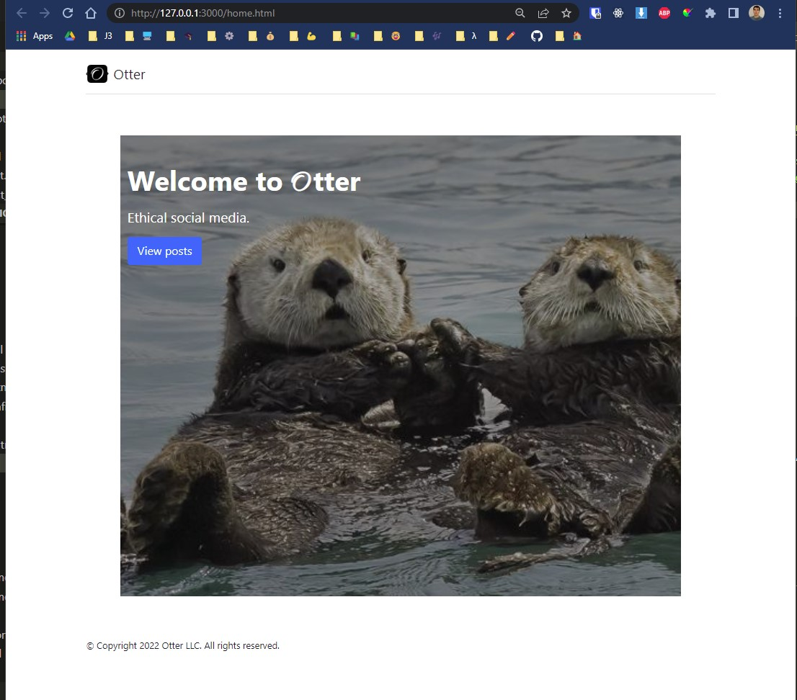
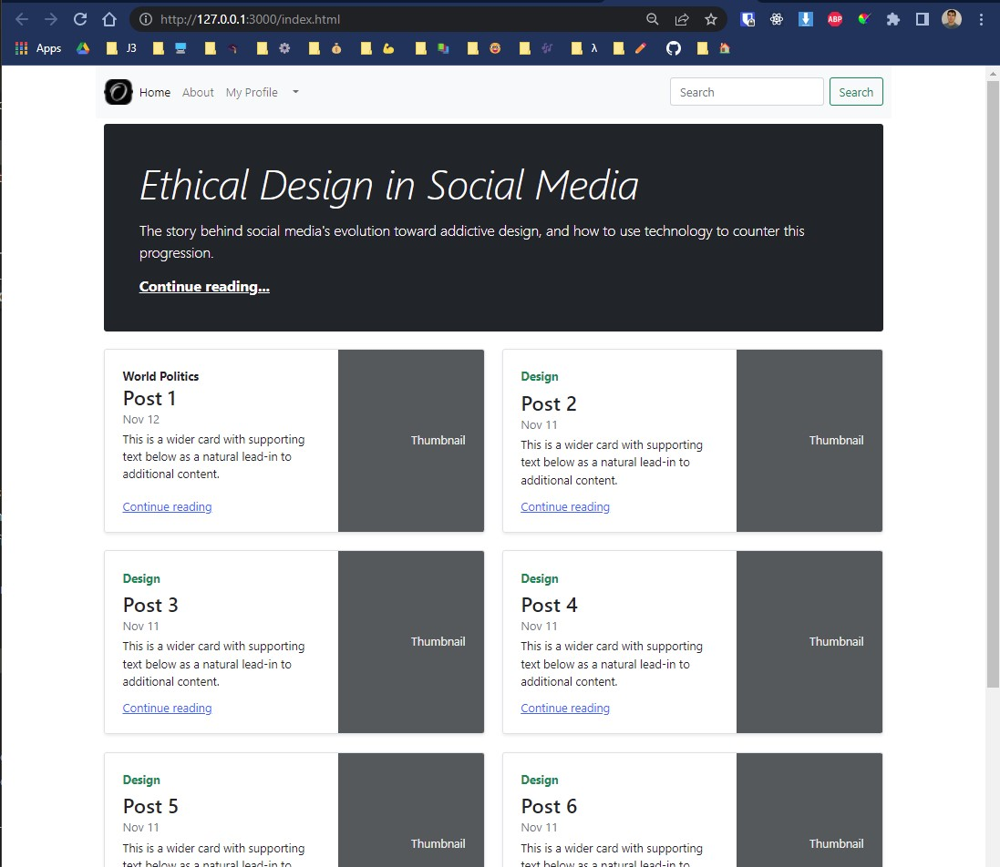

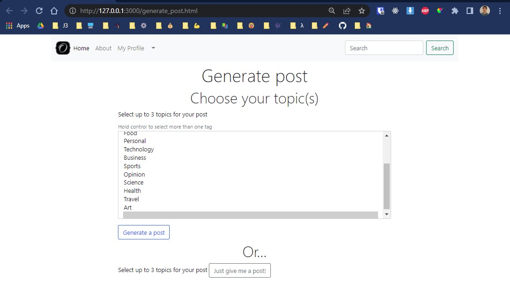
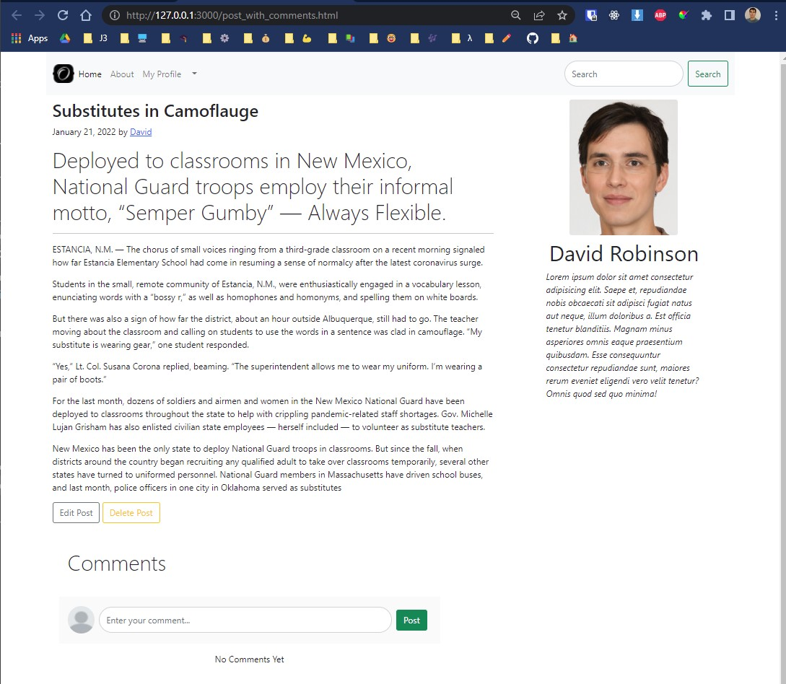

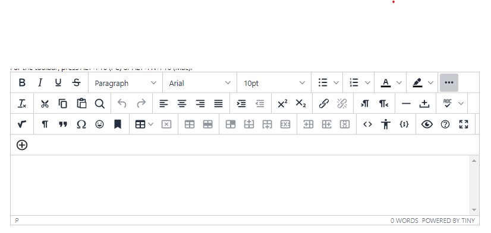
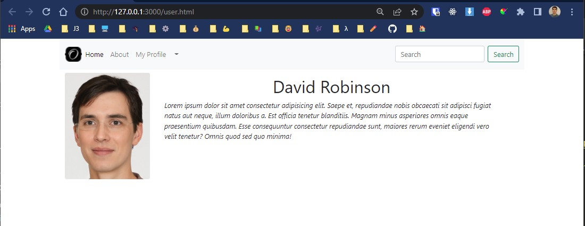

### Flowcharts
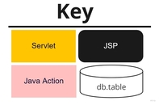

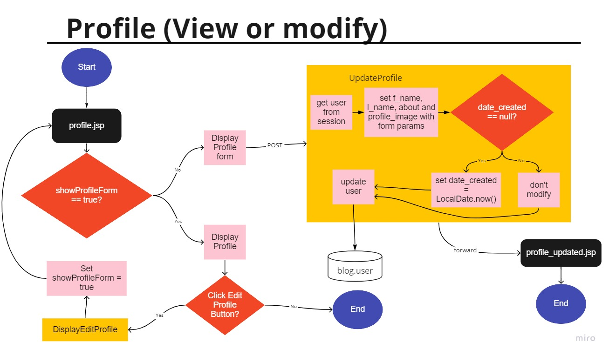
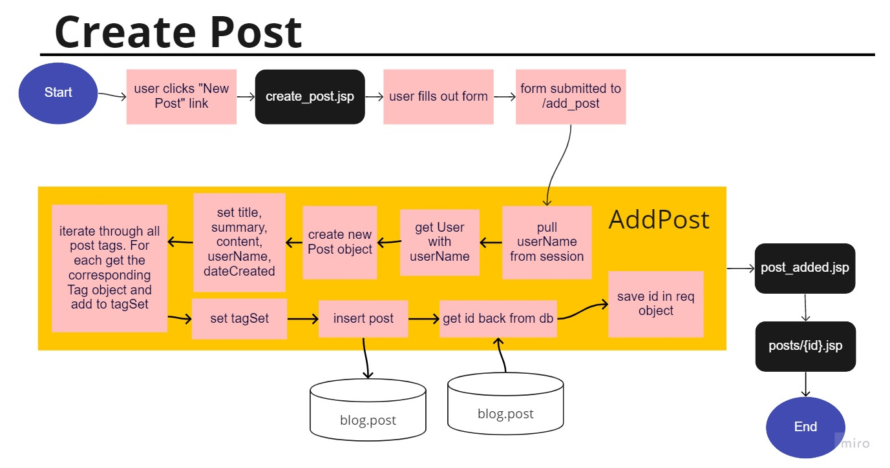
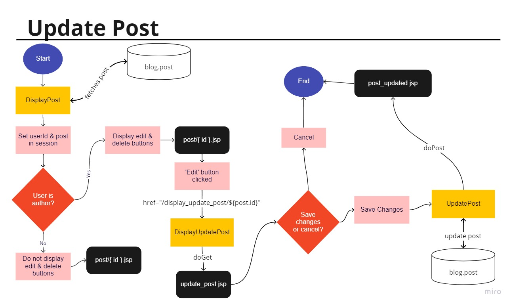
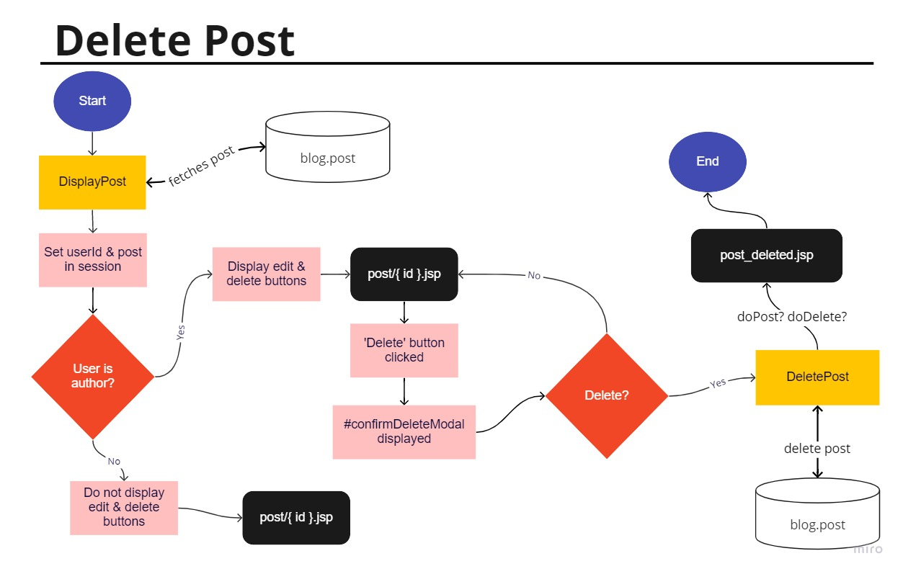
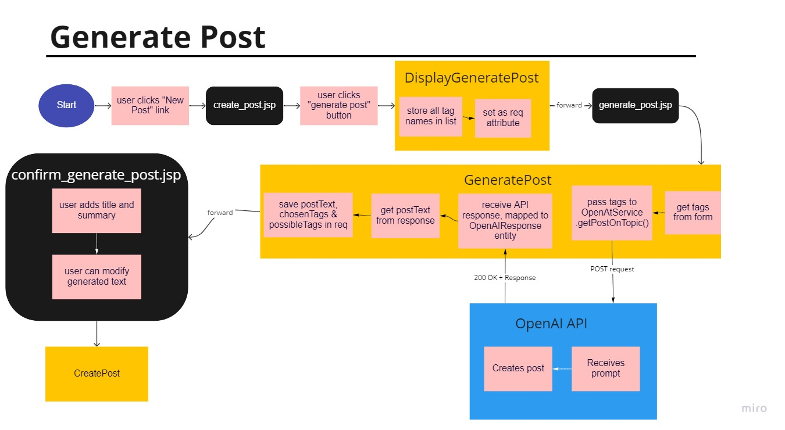

